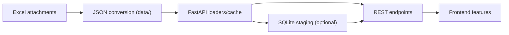

# Excel JSON Datasets Usage Guide

## Overview
This guide documents the JSON datasets generated from the provided Excel attachments and explains how to load and use them from the backend (FastAPI) and persist/relate them in SQLite when needed. These datasets are reference sources used by the application for career roles, adjacency measurements, competency mappings, and navigation scoring. No product flows are changed by these datasets; they enable features such as role recommendations, search facets, taxonomy lookups, and adjacency-driven insights.

## Dataset Inventory
The following files are generated under career_navigator_backend/data/ and mirror the original Excel files and sheet names:

### From Competency_mapping.xlsx
- 20251124_105432_Competency_mapping__Competencies and roles.json
- 20251124_105432_Competency_mapping__Role abbreviations.json
- 20251124_105432_Competency_mapping__Competency Definitions.json
- 20251124_105432_Competency_mapping__Legend.json

### From CA_Role_Adjacency.xlsx
- 20251124_105429_CA_Role_Adjacency__Adjacency (Overlap %).json
- 20251124_105429_CA_Role_Adjacency__Adjacency vs CA.json
- 20251124_105429_CA_Role_Adjacency__Gaps CA→Roles (Top 10).json
- 20251124_105429_CA_Role_Adjacency__Gaps CA→Roles (All).json

### From CA_Role_Adjacency29.xlsx
- 20251124_105431_CA_Role_Adjacency29__Adjacency (Overlap %).json
- 20251124_105431_CA_Role_Adjacency29__Adjacency vs CA.json
- 20251124_105431_CA_Role_Adjacency29__Gaps CA→Roles (Top 10).json
- 20251124_105431_CA_Role_Adjacency29__Gaps CA→Roles (All).json

### From Role_Navigator_Worksheet.xlsx
- 20251124_105432_Role_Navigator_Worksheet__Navigator.json
- 20251124_105432_Role_Navigator_Worksheet__Instructions.json
- 20251124_105432_Role_Navigator_Worksheet__Column Guidance.json

Note: The JSON structure preserves original headers as keys and keeps values as typed where numeric values were present in the workbook. Non-numeric proficiency values and ranges (e.g., “P–A”, “A–Au”) are preserved as strings.

## Feature Usage Mapping
### Career Roles feature
- Use Role abbreviations to map canonical role names to downstream display or filtering logic.
- Use Competencies and roles to display role-to-competency proficiency matrices and drive filters by competency.

### Recommendations and adjacency
- Use Adjacency (Overlap %) to compute similarity or adjacency between roles for recommendation carousels and “You might also consider” features.
- Use Adjacency vs CA for CA-centric proximity views.
- Use Gaps CA→Roles to explain capability deltas for a target role; this powers explanation UIs and coaching prompts.

### Search facets and taxonomy
- Use Competency Definitions to power tooltips and glossary views for each competency facet.
- Use Legend to render proficiency/range explanations in help panels.

### Navigator scoring and prioritization
- Use Role_Navigator_Worksheet’s Navigator to seed default weights and example scoring columns for prioritization views.
- Use Instructions and Column Guidance sheets to populate help and “how to score” panels in the Navigator views.

## FastAPI Integration
The backend already has a FastAPI app at src/api/main.py with a health endpoint. Below are example patterns to load and expose the JSON datasets as REST endpoints.

### Loading utilities
Create lightweight helpers inside the FastAPI app to read JSON from the data directory and return typed responses. Example:

```python
# file: career_navigator_backend/src/api/main.py (illustrative snippet)
from fastapi import FastAPI, HTTPException
from fastapi.middleware.cors import CORSMiddleware
from pathlib import Path
import json

app = FastAPI()
app.add_middleware(
    CORSMiddleware,
    allow_origins=["*"],
    allow_credentials=True,
    allow_methods=["*"],
    allow_headers=["*"],
)

DATA_DIR = Path(__file__).resolve().parents[2] / "data"

def load_json_file(name: str):
    fpath = DATA_DIR / name
    if not fpath.exists():
        raise HTTPException(status_code=404, detail=f"Dataset not found: {name}")
    with fpath.open("r", encoding="utf-8") as f:
        return json.load(f)

@app.get("/")
def health_check():
    return {"message": "Healthy"}

@app.get("/datasets")
def list_datasets():
    files = [p.name for p in DATA_DIR.glob("*.json")]
    return {"datasets": sorted(files)}

@app.get("/datasets/{dataset_name}")
def get_dataset(dataset_name: str):
    # Ensure dataset_name is only a filename
    if "/" in dataset_name or "\\" in dataset_name:
        raise HTTPException(status_code=400, detail="Invalid dataset name")
    return load_json_file(dataset_name)
```

### Example endpoints to support feature queries
- GET /adjacency/ca
  - Returns “Adjacency vs CA” rows to render ranked overlaps.
- GET /adjacency/matrix
  - Returns “Adjacency (Overlap %)” matrix for role-to-role similarity.
- GET /competencies/roles
  - Returns “Competencies and roles” matrix for role view pages.
- GET /competencies/definitions
  - Returns “Competency Definitions” for glossary.

Example:

```python
@app.get("/adjacency/ca")
def get_adjacency_vs_ca():
    return load_json_file("20251124_105429_CA_Role_Adjacency__Adjacency vs CA.json")

@app.get("/adjacency/matrix")
def get_adjacency_matrix():
    return load_json_file("20251124_105429_CA_Role_Adjacency__Adjacency (Overlap %).json")

@app.get("/competencies/roles")
def get_competencies_roles():
    return load_json_file("20251124_105432_Competency_mapping__Competencies and roles.json")

@app.get("/competencies/definitions")
def get_competency_definitions():
    return load_json_file("20251124_105432_Competency_mapping__Competency Definitions.json")
```

## Caching Strategy
- In-memory cache: For static datasets, cache data structures in module-level variables on first load to minimize I/O. Provide a GET /datasets/refresh endpoint (optional) to invalidate cache during admin refresh.
- ETag/Last-Modified: Use response headers to help clients cache datasets.
- TTL cache: Apply LRU or TTL caching via functools.lru_cache or an in-memory library for small datasets.

Example:

```python
from functools import lru_cache

@lru_cache(maxsize=128)
def cached_load_json_file(name: str):
    return load_json_file(name)
```

## Data Validation
When reading JSON, validate shape and keys before use:
- Required fields for adjacency: headers must include a label column and role columns; values numeric.
- Required fields for competencies: must include Competency as a string and role codes as strings from Legend.
- Use pydantic models for response validation if you plan to expose strict schemas.

Example pydantic model for Adjacency vs CA rows:

```python
from pydantic import BaseModel
from typing import List

class AdjacencyVsCARow(BaseModel):
    Role: str
    Overlap_with_Chief_Architect___: float  # map key with spaces to field safely if normalizing

class AdjacencyVsCAResponse(BaseModel):
    sheet: str
    headers: List[str]
    rows: List[AdjacencyVsCARow]
```

Note: If normalizing field names for API responses, keep a consistent mapping layer but do not change the source JSON files.

## SQLite Integration Patterns
Use SQLite for persistence or analytics joins when needed while keeping the JSON as the reference source.

### Option A: Load JSON into staging tables
- Create staging tables mirroring JSON headers.
- Load JSON periodically (init or admin refresh) and use SQL for joins/queries.

Example DDL snippets:

```sql
-- Adjacency vs CA
CREATE TABLE IF NOT EXISTS adjacency_vs_ca (
  role TEXT PRIMARY KEY,
  overlap_with_ca REAL NOT NULL
);

-- Competency definitions
CREATE TABLE IF NOT EXISTS competency_definitions (
  competency TEXT PRIMARY KEY,
  definition TEXT NOT NULL
);
```

Example loader (Python):

```python
import sqlite3
from pathlib import Path
import json

DB_PATH = Path(__file__).resolve().parents[3] / "career_navigator_database" / "myapp.db"

def load_adjacency_vs_ca_to_sqlite():
    data = load_json_file("20251124_105429_CA_Role_Adjacency__Adjacency vs CA.json")
    rows = data.get("rows", [])
    with sqlite3.connect(DB_PATH) as conn:
        conn.execute("""CREATE TABLE IF NOT EXISTS adjacency_vs_ca (
            role TEXT PRIMARY KEY,
            overlap_with_ca REAL NOT NULL
        )""")
        conn.executemany(
            "REPLACE INTO adjacency_vs_ca (role, overlap_with_ca) VALUES (?, ?)",
            [(r["Role"], float(r["Overlap with Chief Architect (%)"])) for r in rows]
        )
        conn.commit()
```

### Option B: Query JSON on-demand
- Keep data as files and load into memory, using Python to handle filtering, searching, and computing insights.
- This approach avoids schema migrations but trades off SQL capabilities.

## Security and Reliability Notes
- Validate dataset_name inputs to prevent path traversal.
- Treat all JSON as read-only references; writes should only occur via controlled admin tools.
- Add try/except around file I/O; return 404 for missing files and 500 for parse errors without leaking stack traces.
- Consider unit tests for endpoints to ensure contract stability.

## Example Frontend Consumption
- Frontend can call /datasets and then GET specific datasets by name.
- For feature-specific views, call semantic endpoints like /adjacency/matrix or /competencies/roles to decouple UI from filenames.

## Change Control
- When Excel sources change, regenerate JSON with the same naming convention: <excelBase>__<sheetName>.json.
- Do not infer or add fields; preserve original headers and values.

## Mermaid: Data Flow Overview


## References
- FastAPI app scaffolding: career_navigator_backend/src/api/main.py
- Data directory: career_navigator_backend/data/
- SQLite database (existing): career_navigator_database/myapp.db
